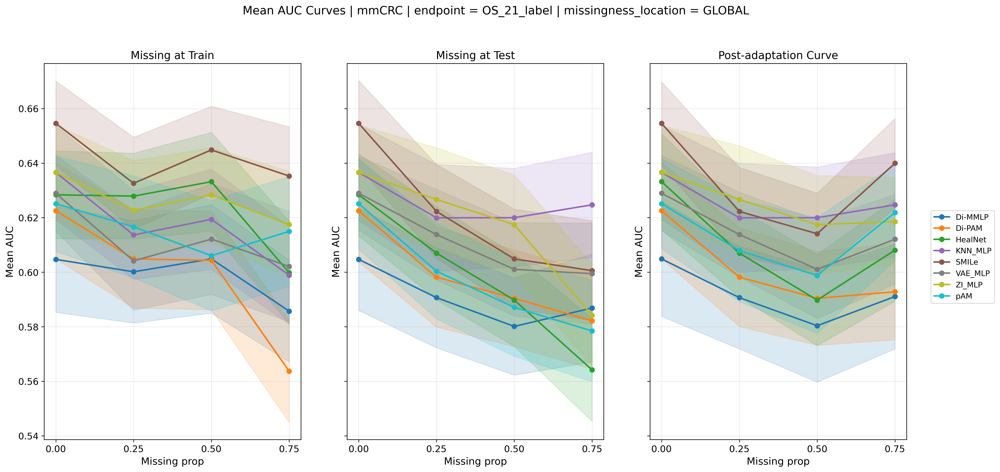
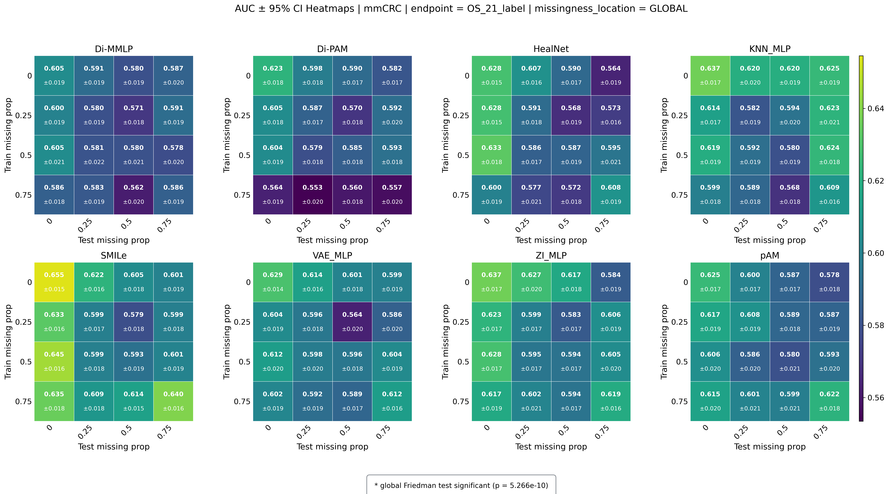
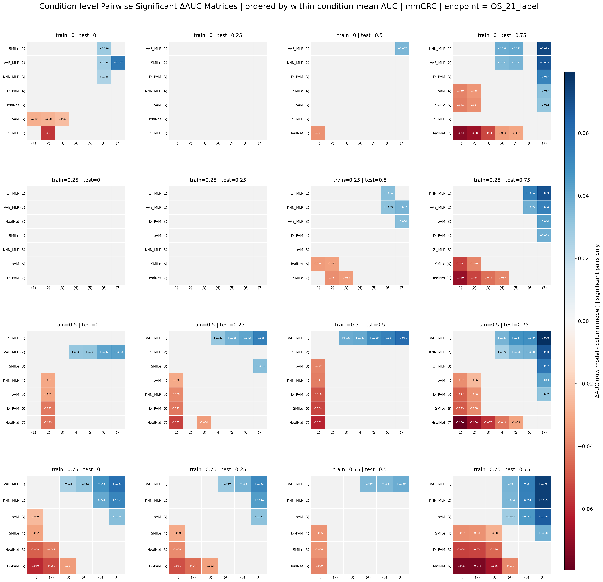
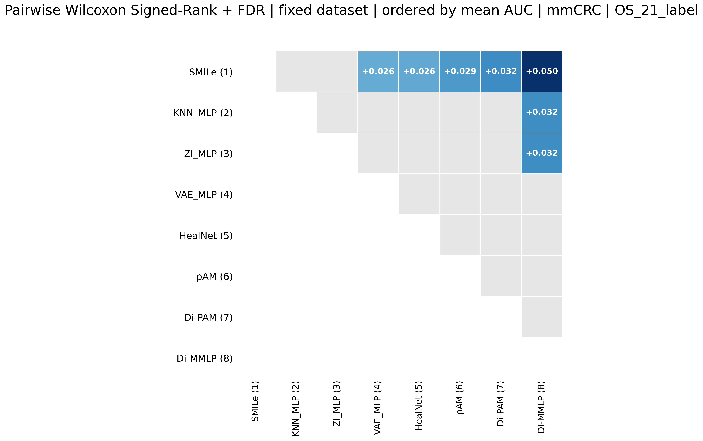

# Analysis Workflows

This folder contains the notebooks and helper code used to summarize M3TRICS outputs after nested cross-validation training. The analysis is split into two complementary views:

- `progressive_missingness_analysis.ipynb`: progressive missingness study for controlled train/test missing-modality conditions.
- `fixed_dataset_analysis.ipynb`: fixed complete-test-dataset comparison.
- `survival_progressive_missingness_analysis.ipynb`: C-index version of the progressive missingness study for survival predictions.
- `survival_fixed_dataset_analysis.ipynb`: C-index version of the fixed dataset comparison for survival predictions.
- `results_analysis.py`: shared loading, aggregation, ranking, significance testing, and plotting utilities.

The notebooks expect M3TRICS result folders under `../results/<dataset_tag>/training_runs/`. Generated summaries are written under analysis-specific output folders and can be regenerated from the notebooks.

The classification notebooks use AUC as the base predictive metric. The survival notebooks use C-index computed from stored survival risk scores and then reuse the same AUPMC, degradation, ranking, and condition-level statistical workflow.

## Progressive Missingness Study

`progressive_missingness_analysis.ipynb` studies how each method behaves as missingness increases. The replicate unit depends on the execution mode. With `USE_ENSEMBLE=false`, retained inner models use seed, outer fold, and inner model index, while outer-retrained models use seed and outer fold. With `USE_ENSEMBLE=true`, the notebook computes or uses probability-averaged ensemble predictions as one replicate per seed and outer fold. The notebook expands the stored predictions, computes replicate AUCs, aggregates them by missingness condition, and then builds rankings and statistical comparisons. Distillation methods are explicitly configured through `DISTILLATION_MODEL_NAMES`; they are excluded from Train-time AUPMC and Train degradation coefficient because train-time missingness is applied to the student while the teacher receives complete modality information.

### Method-Level Curves

The notebook first plots method-level curves before showing the metric tables. The raw mean AUC curves summarize three trajectories: train-time missingness, test-time missingness, and the best fixed-train curve. It also generates pointwise degradation curves, where the method's baseline AUC is divided by the AUC at each missingness condition. These curves visualize relative degradation along each trajectory, including values below 1 when a method improves over its complete-data baseline.

### Method-Level Metrics and Rankings

The method-level tables summarize behavior into AUPMC metrics and degradation coefficients. The metrics are: Baseline AUC, Train-time AUPMC, Train degradation coefficient, Test-time AUPMC, Test degradation coefficient, Best fixed-train AUPMC, and Minimum degradation coefficient. Degradation coefficients are computed as the normalized positive degradation area, using `max(baseline / performance - 1, 0)` along each trajectory. Train-time and test-time degradation use the complete-data baseline `(train=0, test=0)`. Best fixed-train degradation uses the selected fixed-train baseline `(train=m_train*, test=0)`, because that trajectory measures degradation as test missingness increases after selecting one training missingness regime. Missingness levels where a method improves over the relevant baseline therefore contribute 0 and do not compensate degradation elsewhere. Lower values indicate less relative degradation, with 0 indicating no positive degradation over the trajectory. AUPMC and degradation coefficients include bootstrap 95% confidence intervals in `method_level_metrics.csv`; metric rankings are still based only on the mean point estimates. For distillation methods, train missingness in both/best fixed-train settings refers to the student branch. The ranking table orders methods separately for each metric, making it useful for identifying methods that are globally strong, not only methods that win a single missingness cell.

Main outputs:

- `replicate_auc_table.csv`: replicate-level AUCs used as the statistical unit; when `USE_ENSEMBLE=true`, ensemble probabilities are computed downstream from retained inner-model predictions if not already stored.
- `method_condition_mean_auc_summary.csv`: mean AUC and confidence intervals per method and missingness condition.
- `method_level_metrics.csv`: Baseline AUC, Train-time AUPMC, Train degradation coefficient, Test-time AUPMC, Test degradation coefficient, Best fixed-train AUPMC, selected train missingness, Minimum degradation coefficient, and bootstrap 95% CIs for AUPMC/degradation metrics.
- `method_metric_orderings.csv`: ranking/order table for each summary metric.
- `method_plot_summary.csv`: mean AUC curves for train-time missingness, test-time missingness, and the best fixed-train curve.
- `degradation_curve_summary.csv`: pointwise degradation curves computed as baseline AUC divided by condition-level AUC.
- `best_fixed_train_curve.csv`: best fixed-train behavior over train-missingness settings, used for Best fixed-train AUPMC and Minimum degradation coefficient.
- `general_results_summary.csv`: compact scenario-level winners for complete data, train-time missingness, test-time missingness, missing at both, and most flexible method.
- `top_equivalent_group_counts.csv`: number of condition-level top-equivalent group appearances per method.
- `level1_global_friedman.csv`: global Friedman test over paired replicate AUCs.

### Level 2: Pairwise Condition Matrices

Level 2 compares methods pairwise within each train/test missingness condition. Each matrix cell represents a significant winner-loser relationship after paired Wilcoxon testing and FDR correction. The lower triangle is intentionally left blank; the upper triangle contains the readable comparison area, with non-significant cells shown in gray.

Main outputs:

- `wilcoxon_significant.csv`: significant pairwise method comparisons after correction.
- Pairwise matrix figures: visual ranking of which methods significantly outperform others under each condition.

### Level 3: Significant Pair Summary

Level 3 collapses the significant pairwise tests into an overview of robust winners and losers. For each missingness condition, methods are first ordered by mean AUC. The plot then finds the first lower-ranked method that the top-ranked method beats significantly after FDR correction. The "top equivalent methods" are the contiguous higher-ranked methods that are all statistically significantly better than that same lower-ranked AUC method. They are called equivalent because the plot treats them as the leading group above the same statistical boundary; it does not claim they are significantly different from each other.

This makes the last graph a compact answer to: which methods form the top statistically supported tier, and which lower-ranked method defines the separation from the rest?

## Fixed Dataset Analysis

`fixed_dataset_analysis.ipynb` compares methods when evaluation is restricted to the complete fixed test setting: `train_missing_prop = 0.0` and `test_missing_prop = 0.0`. In the current mmColorectal example, fixed outputs are formatted exactly like normal M3TRICS outputs under each method's `FIXED/seed_*` folder, so the same loader and aggregation logic can be reused.

### AUC Distribution

The violin shows the distribution of replicate AUCs per method, and the black points are the individual replicate results. This plot is meant to show both the full spread and the exact replicate-level evidence behind the ranking.

### Fixed Pairwise Ranking

The fixed pairwise matrix compares methods using paired Wilcoxon tests over shared replicate IDs. Methods are ordered by mean AUC. The row method is the higher-AUC winner and the column method is the lower-AUC loser. Colored cells indicate significant positive mean AUC differences after FDR correction; gray cells are non-significant comparisons among the displayed upper triangle, and the lower triangle is hidden by design.

The top-equivalent interpretation is the same as in the decay Level 3 view: a leading group is considered equivalent when all of its members are significantly better than the same next lower-ranked method by AUC. This identifies the statistically supported top tier without overclaiming significant differences inside that tier.

Main outputs:

- `replicate_auc_table.csv`: replicate-level AUCs for the fixed setting.
- `fixed_dataset_method_condition_summary.csv`: condition-level fixed summary.
- `fixed_dataset_method_summary.csv`: method-level mean AUC, standard deviation, replicate count, and bootstrap confidence interval.
- `fixed_dataset_global_friedman.csv`: global paired Friedman test across methods.
- `fixed_dataset_pairwise_wilcoxon.csv`: all fixed pairwise Wilcoxon comparisons.
- `fixed_dataset_pairwise_significant.csv`: significant fixed pairwise comparisons after correction.
- `fixed_dataset_method_table.csv`: final fixed ranking table combining performance and significance context.

## Interpreting Rankings

Rankings should be read together with the replicate-level statistics. A method can rank first by mean AUC while not significantly beating all alternatives, especially when replicate variance is high. The pairwise Wilcoxon tables and matrices therefore provide the inferential layer behind the ranking tables.

For progressive missingness analysis, rankings answer "which method is robust across missingness scenarios?" For fixed analysis, rankings answer "which method performs best when evaluated on the complete fixed dataset?" These are related but not identical questions.

## Survival C-index Analysis

The survival notebooks mirror the classification workflow but use C-index instead of AUC. They expect survival prediction files with:

- `event_time`
- `event_observed`
- `inner_model_<k>_risk` for retained inner models or outer-retrained models
- optional `inner_model_<k>_logit_bin_*`, `hazard_bin_*`, and `survival_bin_*` columns

For retained inner models, the replicate unit is `seed x outer_fold x inner_model_k`. For outer-retrained models, the replicate unit is `seed x outer_fold`. If `USE_ENSEMBLE=true`, the notebooks average retained inner-model predictions into one ensemble prediction per patient and use `seed x outer_fold` as the replicate unit.

Progressive survival outputs include:

- `replicate_cindex_table.csv`
- `method_condition_mean_cindex_summary.csv`
- `method_plot_summary.csv`
- `degradation_curve_summary.csv`
- `method_level_metrics.csv`
- `method_metric_orderings.csv`
- `best_fixed_train_curve.csv`
- `level1_global_friedman.csv`
- `wilcoxon_significant.csv`
- `top_equivalent_group_counts.csv`
- `general_results_summary.csv`

Fixed survival outputs include:

- `replicate_cindex_table.csv`
- `fixed_dataset_method_condition_summary.csv`
- `fixed_dataset_method_summary.csv`
- `fixed_dataset_global_friedman.csv`
- `fixed_dataset_pairwise_wilcoxon.csv`
- `fixed_dataset_pairwise_significant.csv`
- `fixed_dataset_method_table.csv`

Degradation coefficients in survival analysis use the same positive-area definition as classification: `max(baseline / cindex - 1, 0)` is integrated and normalized across the trajectory. Train-time and test-time curves use the complete-data C-index baseline, while best fixed-train curves use the selected fixed-train C-index at `test=0`. Rankings are based on mean point estimates, while bootstrap 95% CIs are reported for AUPMC and degradation coefficients.
